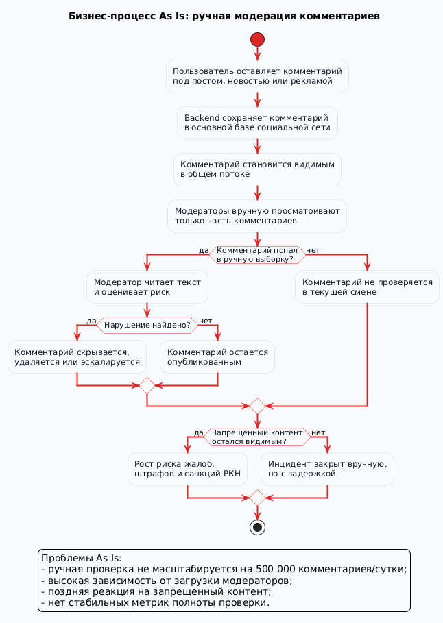
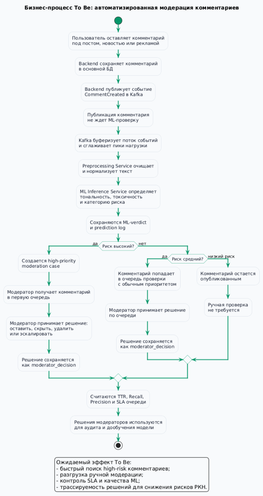

# 1. Бизнес-требования, метрики, пилот и MVP

Автор раздела: Гайдук Алина, владелец продукта.

В этом разделе описана продуктовая часть проекта: зачем нужна система мониторинга пользовательских реакций, какие проблемы она решает для бизнеса, по каким метрикам можно оценить успех пилота и что должно войти в первую версию продукта.

## 1.1 Зачем нужна система

В социальной сети каждый день появляется большой поток комментариев под постами, новостями и рекламными материалами. По условию проекта объем может доходить до 500 000 комментариев в сутки. При таком количестве сообщений полностью ручная проверка становится слишком медленной и дорогой.

Главная проблема в том, что среди обычных реакций пользователей могут появляться токсичные комментарии, мат, запрещенные высказывания или контент, который может привести к жалобам и претензиям со стороны РКН. Если такой комментарий долго остается опубликованным, компания получает не только репутационный риск, но и риск штрафов.

Поэтому цель продукта - автоматизировать первичный анализ комментариев и быстро выделять те сообщения, которые действительно требуют внимания модератора.

## 1.2 Текущий процесс As Is

Сейчас процесс можно описать как ручную или выборочную модерацию. Комментарии публикуются в общем потоке, а модераторы просматривают только часть сообщений. Из-за этого часть опасных комментариев может быть найдена слишком поздно или вообще не попасть в проверку.

Основные проблемы текущего процесса:

- модераторы физически не могут быстро прочитать весь поток комментариев;
- качество проверки зависит от загрузки смены и человеческого фактора;
- нет стабильной оценки, сколько нарушений реально пропускается;
- реакция на опасный контент может быть запоздалой;
- при пропуске запрещенного контента появляются риски жалоб, штрафов и санкций.

Диаграмма текущего процесса:

## 1.3 Целевой процесс To Be

После внедрения системы комментарий не должен ждать ручной проверки перед публикацией. Backend сохраняет комментарий и отправляет событие `CommentCreated` в Kafka. Дальше отдельные сервисы выполняют предобработку текста и ML-анализ.

Модель определяет тональность, вероятность токсичности и категорию риска. Если риск низкий, комментарий остается опубликованным без ручного вмешательства. Если риск средний или высокий, создается задача для модератора. Высокорисковые комментарии должны попадать в очередь с повышенным приоритетом.

Такой подход разгружает модераторов: они проверяют не весь поток подряд, а в первую очередь те сообщения, которые система считает подозрительными.

Диаграмма целевого процесса:

## 1.4 Бизнес-требования

С точки зрения владельца продукта система должна выполнять следующие требования:

- обрабатывать поток до 500 000 комментариев в сутки;
- не замедлять основной пользовательский сценарий публикации комментария;
- автоматически определять риск комментария;
- отправлять спорные и опасные комментарии в ручную модерацию;
- сохранять вердикт ML-модели и итоговое решение модератора;
- давать возможность считать метрики качества модерации;
- помогать компании быстрее реагировать на потенциально запрещенный контент.

Отдельно важно, что система не заменяет модератора полностью. На этапе MVP она должна работать как фильтр и помощник: быстро подсвечивать опасные случаи и уменьшать объем ручной проверки.

## 1.5 MVP

В первую версию продукта нужно включить только самое необходимое:

- прием событий о новых комментариях;
- автоматическую ML-оценку комментария;
- разделение комментариев по уровню риска;
- очередь ручной модерации для средних и высоких рисков;
- сохранение решений модераторов;
- базовый отчет по количеству найденных нарушений и скорости реакции.

В MVP не нужно сразу делать сложную систему автоматического переобучения модели и расширенную аналитику. Эти задачи можно оставить на следующие версии, потому что сначала важно проверить саму бизнес-гипотезу: помогает ли автоматизация быстрее находить опасные комментарии.

## 1.6 Метрики успеха

Для оценки результата пилота я бы использовала несколько групп метрик.

Метрики качества обнаружения:

- `Recall` по критичным нарушениям - важно находить как можно больше опасных комментариев;
- `Precision` по рискованным комментариям - важно не перегружать модераторов ложными срабатываниями;
- доля пропущенных нарушений после ручной проверки.

Метрики скорости:

- среднее время от публикации комментария до ML-вердикта;
- среднее время от попадания в очередь до решения модератора;
- доля high-risk комментариев, обработанных в заданное SLA.

Бизнес-метрики:

- снижение объема ручной проверки;
- уменьшение числа жалоб на запрещенный или токсичный контент;
- снижение риска штрафов за несвоевременную модерацию.

## 1.7 Критерии успешного пилота

Пилот можно считать успешным, если выполняются следующие условия:

- модель находит не менее 95% критичных нарушений;
- очередь модерации становится меньше и понятнее по приоритетам;
- большинство high-risk комментариев обрабатывается в целевое время;
- безопасные комментарии не создают лишнюю нагрузку на модераторов;
- публикация комментариев для пользователей не становится медленнее;
- команда может видеть отчеты по качеству работы модели и модераторов.

## 1.8 Что остается в техдолге

После MVP останутся задачи, которые важны для развития продукта, но не обязательны для первого запуска:

- автоматическое отслеживание изменения сленга и новых способов обхода фильтров;
- регулярное дообучение модели на решениях модераторов;
- более подробные дашборды для аналитики;
- отдельные правила для разных типов контента;
- более гибкая настройка порогов риска.

## 1.9 Основные риски

Основные риски проекта связаны с качеством модели и нагрузкой на модерацию.

Если модель будет часто ошибаться в сторону ложных срабатываний, модераторы получат слишком большую очередь и перестанут доверять системе. Если модель будет пропускать опасные комментарии, продукт не решит главную задачу - снижение рисков для компании.

Чтобы уменьшить эти риски, нужно регулярно сравнивать решения модели с решениями модераторов, пересматривать пороги риска и собирать новые примеры для обучения.

## 1.10 Вывод

Система мониторинга пользовательских реакций нужна не просто для анализа тональности, а для управления рисками модерации. Главная ценность продукта в том, что он помогает быстрее находить опасные комментарии, снижает нагрузку на ручную проверку и дает компании измеримые показатели качества модерации.

Для первого этапа достаточно MVP, который принимает комментарии, оценивает их ML-моделью, отправляет спорные случаи модераторам и собирает базовые метрики. После успешного пилота систему можно развивать за счет более сложной аналитики, дообучения модели и гибких правил модерации.
