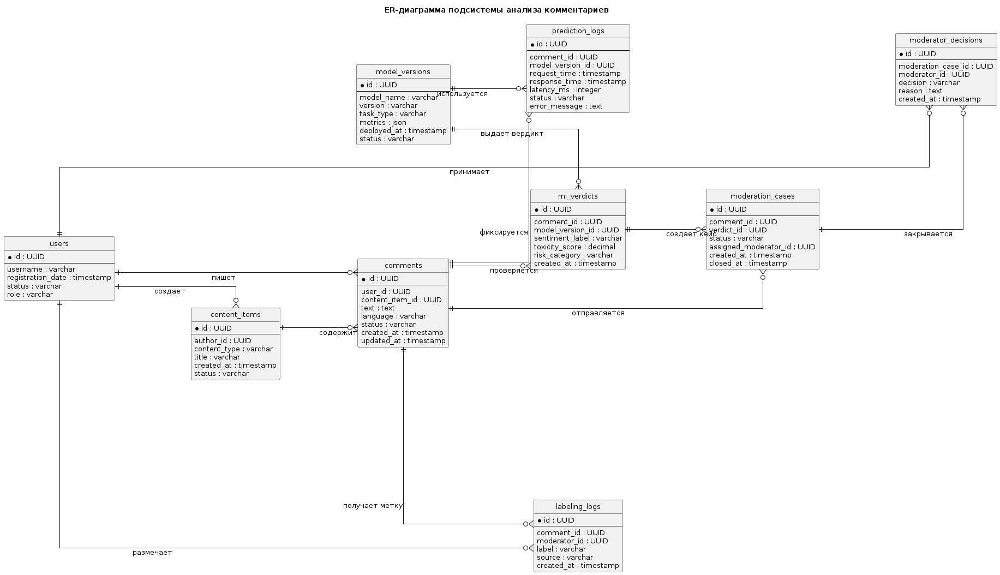
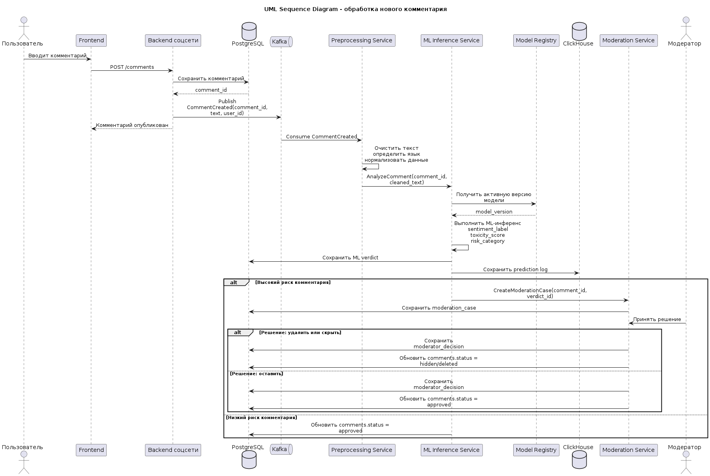
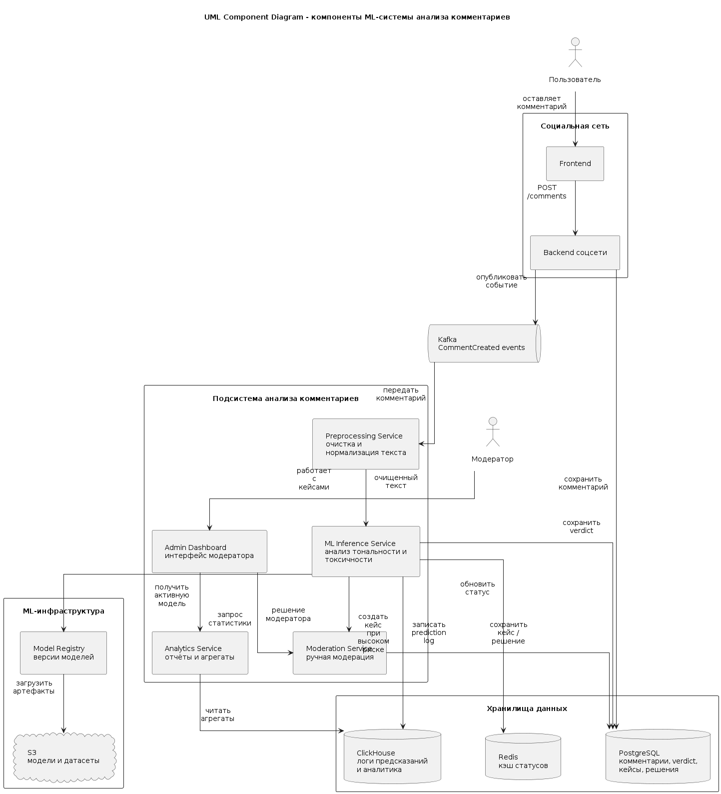
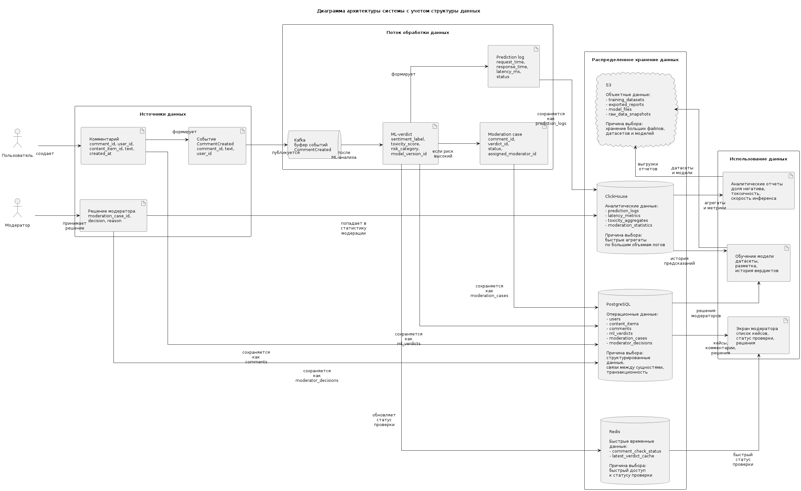

# 3. Архитектура системы и данных

## 3.1 Назначение архитектуры

Архитектура системы предназначена для автоматической обработки пользовательских комментариев в социальной сети с использованием ML-модели анализа тональности и токсичности. Система должна принимать поток новых комментариев, выполнять предварительную обработку текста, запускать ML-инференс, сохранять результат проверки и передавать потенциально опасные комментарии в ручную модерацию.

Требование к архитектуре - способность обрабатывать до 500 000 комментариев в день без блокировки основного backend соцсети. Для этого обработка комментариев строится асинхронно: основной backend публикует событие о новом комментарии в очередь сообщений, а отдельные сервисы выполняют анализ и сохраняют результаты независимо от пользовательского сценария публикации комментария.

## 3.2 Общая схема обработки комментария

Основной сценарий работы системы выглядит следующим образом:

1. Пользователь оставляет комментарий под постом, новостью или рекламным материалом.
2. Backend соцсети сохраняет комментарий в основную базу данных.
3. Backend публикует событие `CommentCreated` в Kafka.
4. Сервис предварительной обработки получает событие, очищает текст комментария и подготавливает его для ML-модели.
5. Сервис инференса вызывает ML-модель и получает результат: тональность, вероятность токсичности и категорию риска.
6. Результат анализа сохраняется в хранилище verdict-данных.
7. Если комментарий имеет высокий риск, создаётся кейс ручной модерации.
8. Модератор принимает решение: оставить комментарий, скрыть, удалить или отправить на повторную проверку.
9. Решение модератора сохраняется и может использоваться как данные для последующего дообучения модели.

## 3.3 Компоненты системы

Система состоит из следующих компонентов:

### Backend соцсети

Отвечает за основной пользовательский сценарий: публикацию комментариев, хранение комментариев и отображение контента пользователям. Backend не выполняет ML-анализ синхронно, чтобы публикация комментария не зависела от скорости работы модели.

### Kafka

Используется как очередь сообщений между backend соцсети и сервисами анализа комментариев. Kafka позволяет сглаживать пики нагрузки и гарантировать, что комментарии не будут потеряны при временной недоступности ML-сервиса.

### Preprocessing Service

Выполняет предварительную обработку текста: нормализацию, удаление лишних символов, определение языка, фильтрацию пустых или некорректных сообщений.

### ML Inference Service

Выполняет анализ комментария с помощью ML-модели. На выходе сервис формирует verdict: тональность комментария, вероятность токсичности, категорию риска и версию модели.

### Moderation Service

Создаёт задачи для ручной модерации, если комментарий получил высокий уровень риска. Также хранит решения модераторов.

### Analytics Service

Агрегирует статистику по комментариям, тональности, токсичности, количеству спорных случаев и качеству работы модели.

### Admin Dashboard

Интерфейс для модераторов и администраторов. Через него можно просматривать подозрительные комментарии, принимать решения и анализировать статистику.

## 3.4 Архитектура данных

Основные сущности системы:

### users

Хранит информацию о пользователях социальной сети.

Основные поля:

- id
- username
- registration_date
- status
- role

### content_items

Хранит информацию о постах, новостях или рекламных материалах, под которыми пользователи оставляют комментарии.

Основные поля:

- id
- author_id
- title
- status
- content_type
- created_at

### comments

Хранит пользовательские комментарии.

Основные поля:

- id
- user_id
- content_item_id
- text
- language
- created_at
- updated_at
- status

### ml_verdicts

Хранит результаты работы ML-модели.

Основные поля:

- id
- comment_id
- sentiment_label
- toxicity_score
- risk_category
- model_version_id
- created_at

### moderation_cases

Хранит случаи, отправленные на ручную модерацию.

Основные поля:

- id
- comment_id
- verdict_id
- status
- created_at
- assigned_moderator_id

### moderator_decisions

Хранит итоговые решения модераторов.

Основные поля:

- id
- moderation_case_id
- moderator_id
- decision
- reason
- created_at

### model_versions

Хранит информацию о версиях ML-моделей.

Основные поля:

- id
- model_name
- version
- metrics
- task_type
- deployed_at
- status

### prediction_logs

Хранит технические логи инференса.

Основные поля:

- id
- comment_id
- model_version_id
- request_time
- response_time
- latency_ms
- status
- error_message

### labeling_logs

Хранит данные ручной разметки комментариев, которые могут использоваться для анализа качества модели и последующего формирования обучающего датасета.

Основные поля:

- id
- comment_id
- moderator_id
- label
- source
- created_at

### ER-диаграмма



ER-диаграмма показывает структуру данных подсистемы анализа комментариев. Центральной сущностью является `comments`, так как именно комментарии проходят ML-анализ и при необходимости отправляются в ручную модерацию. Таблицы `ml_verdicts`, `moderation_cases`, `moderator_decisions`, `prediction_logs` и `model_versions` позволяют хранить результаты работы модели, решения модераторов и историю инференса.

## 3.5 Обоснование распределённого хранения

Данные системы имеют разную структуру, скорость записи и сценарии чтения, поэтому используются разные типы хранилищ.

PostgreSQL используется для хранения основных бизнес-сущностей: пользователей, комментариев, кейсов модерации и решений модераторов. Эти данные имеют строгую структуру и требуют связей между таблицами.

Kafka используется для передачи событий о новых комментариях между сервисами. Это позволяет обрабатывать комментарии асинхронно и не блокировать основной backend соцсети.

ClickHouse используется для хранения логов предсказаний и аналитических данных. Такие данные записываются большим потоком и часто используются для агрегированных запросов: количество негативных комментариев, средняя задержка инференса, доля комментариев, отправленных на модерацию.

Redis используется для кэширования часто запрашиваемых данных: статуса проверки комментария, последних verdict-результатов и временных технических данных.

S3 используется для хранения датасетов, выгрузок, артефактов обучения и файлов моделей. Эти данные имеют большой объём и не требуют реляционной структуры.

## 3.6 Нефункциональные требования

Система должна обрабатывать до 500 000 комментариев в день. Средняя нагрузка составляет примерно 5.8 комментария в секунду, однако из-за неравномерной активности пользователей архитектура должна выдерживать пиковую нагрузку до 100 комментариев в секунду.

Основные требования:

- SLA сервиса анализа комментариев: 99.5%;
- средняя задержка ML-инференса: до 500 мс;
- доставка комментария в ручную модерацию: до 5 секунд;
- потеря сообщений о новых комментариях недопустима;
- сервис инференса должен масштабироваться горизонтально;
- при недоступности ML-сервиса комментарии должны накапливаться в очереди и обрабатываться после восстановления;
- все результаты предсказаний должны сохраняться вместе с версией модели.

## 3.7 UML-диаграммы

### Sequence-диаграмма



Sequence-диаграмма показывает сценарий обработки нового комментария. Пользователь отправляет комментарий, backend сохраняет его и публикует событие в Kafka. Далее комментарий проходит предварительную обработку, ML-инференс, сохранение verdict и при высоком риске передается в ручную модерацию.

### Component-диаграмма



Component-диаграмма показывает основные программные компоненты системы: backend социальной сети, Kafka, сервис предварительной обработки, ML Inference Service, Moderation Service, Analytics Service и Admin Dashboard. Также показаны внешние зависимости: PostgreSQL, ClickHouse, Redis, S3 и Model Registry.

### Диаграмма архитектуры системы с учетом структуры данных



Диаграмма показывает, как данные распределяются между несколькими хранилищами. PostgreSQL используется для операционных данных, ClickHouse - для логов и аналитики, Redis - для быстрых статусов проверки, S3 - для датасетов и файлов моделей. Такое разделение необходимо, потому что разные типы данных имеют разные требования к скорости записи, структуре, объему и сценариям чтения.

## 3.8 Риски архитектуры

### Риск перегрузки ML Inference Service

При резком росте количества комментариев сервис инференса может стать узким местом, так как именно он выполняет наиболее тяжелую операцию — запуск ML-модели. Если сервис не успевает обрабатывать сообщения из Kafka, очередь начнет расти, а комментарии будут дольше оставаться без проверки.

Для снижения риска ML Inference Service должен масштабироваться горизонтально. Также необходимо отслеживать размер consumer lag в Kafka, среднюю задержку инференса и процент ошибок при обработке комментариев.

### Риск накопления сообщений в Kafka

Если один из сервисов обработки временно недоступен, события о новых комментариях будут накапливаться в Kafka. Это защищает систему от потери данных, но при длительном сбое может привести к большой задержке обработки комментариев.

Для снижения риска необходимо настроить мониторинг consumer lag, алерты на рост очереди и повторную обработку сообщений после восстановления сервиса. Также важно задавать достаточный срок хранения сообщений в Kafka, чтобы события не были удалены до обработки.

### Риск потери согласованности между хранилищами

Данные системы хранятся в нескольких местах: PostgreSQL, ClickHouse, Redis и S3. Из-за этого возможна ситуация, когда verdict уже сохранен в PostgreSQL, но prediction log не записался в ClickHouse или статус проверки не обновился в Redis.

Для снижения риска PostgreSQL должен считаться основным источником истины для операционных данных. ClickHouse и Redis используются как производные хранилища: аналитика и кэш могут быть восстановлены на основе основных данных и событий. Для критичных операций необходимо использовать повторные попытки записи и идемпотентную обработку сообщений.

### Риск дублирующей обработки комментариев

При повторной доставке сообщений из Kafka один и тот же комментарий может быть обработан несколько раз. Это может привести к появлению нескольких verdict-записей или повторному созданию кейсов модерации.

Для снижения риска обработка должна быть идемпотентной. Например, для `ml_verdicts` можно использовать уникальную связку `comment_id + model_version_id`, а для `moderation_cases` проверять, существует ли уже открытый кейс по данному комментарию.

### Риск недоступности PostgreSQL

PostgreSQL хранит основные операционные данные: комментарии, ML-вердикты, кейсы модерации и решения модераторов. При его недоступности система не сможет корректно сохранять результаты анализа и решения модерации.

Для снижения риска необходимо использовать резервное копирование, репликацию, регулярную проверку восстановления из backup и мониторинг состояния БД. Также важно ограничивать тяжелые аналитические запросы к PostgreSQL, чтобы не перегружать основное операционное хранилище.

### Риск перегрузки ClickHouse аналитическими запросами

ClickHouse используется для хранения логов предсказаний и аналитики. При большом количестве отчетов или сложных запросов возможна деградация скорости аналитических операций.

Для снижения риска агрегированные отчеты следует строить заранее или использовать материализованные представления. Операционные сценарии модерации не должны зависеть от ClickHouse: если аналитическое хранилище временно недоступно, модерация комментариев должна продолжать работать.

### Риск устаревания кэша в Redis

Redis хранит быстрые статусы проверки комментариев и последние verdict-результаты. Если данные в Redis устареют или будут удалены, пользователь или модератор может увидеть неактуальный статус проверки.

Для снижения риска Redis не должен быть основным источником истины. При отсутствии данных в кэше система должна обращаться к PostgreSQL. Для кэшируемых записей необходимо задавать TTL и обновлять кэш после изменения статуса комментария.

### Риск недоступности S3

S3 используется для хранения датасетов, выгрузок, артефактов обучения и файлов моделей. При недоступности S3 могут быть невозможны обучение новой модели, загрузка новых артефактов или формирование выгрузок.

Для снижения риска активная версия модели должна быть кэширована или заранее загружена в ML Inference Service. Недоступность S3 не должна останавливать уже развернутую production-модель, если её артефакты уже доступны сервису инференса.

### Риск роста объема данных

Prediction logs, история модерации и аналитические события могут быстро расти по объему. Если не ограничивать срок хранения и не проектировать партиционирование, это приведет к росту стоимости хранения и замедлению запросов.

Для снижения риска необходимо использовать партиционирование логов по времени, политику хранения данных и архивирование старых данных. Например, детальные prediction logs можно хранить ограниченное время, а для долгосрочной аналитики оставлять агрегаты.

### Риск блокировки пользовательского сценария

Если ML-анализ выполнять синхронно при публикации комментария, пользователь будет ждать ответа модели. При высокой нагрузке это ухудшит UX и может привести к ошибкам публикации комментариев.

Для снижения риска анализ выполняется асинхронно через Kafka. Backend соцсети сохраняет комментарий и публикует событие, а ML-проверка выполняется отдельно. Это позволяет не блокировать основной пользовательский сценарий.

# Приложение

## Код Sequence-диаграммы

```plantUML
@startuml
title UML Sequence Diagram - обработка нового комментария

skinparam shadowing false
skinparam sequenceMessageAlign center
skinparam maxMessageSize 200

actor "Пользователь" as User
participant "Frontend" as Frontend
participant "Backend соцсети" as Backend
database "PostgreSQL" as PostgreSQL
queue "Kafka" as Kafka
participant "Preprocessing Service" as Preprocessing
participant "ML Inference Service" as MLService
participant "Model Registry" as ModelRegistry
database "ClickHouse" as ClickHouse
participant "Moderation Service" as ModerationService
actor "Модератор" as Moderator

User -> Frontend : Вводит комментарий
Frontend -> Backend : POST /comments

Backend -> PostgreSQL : Сохранить комментарий
PostgreSQL --> Backend : comment_id

Backend -> Kafka : Publish CommentCreated(comment_id, text, user_id)
Backend --> Frontend : Комментарий опубликован

Kafka -> Preprocessing : Consume CommentCreated
Preprocessing -> Preprocessing : Очистить текст\nопределить язык\nнормализовать данные

Preprocessing -> MLService : AnalyzeComment(comment_id, cleaned_text)
MLService -> ModelRegistry : Получить активную версию модели
ModelRegistry --> MLService : model_version

MLService -> MLService : Выполнить ML-инференс\nsentiment_label\ntoxicity_score\nrisk_category

MLService -> PostgreSQL : Сохранить ML verdict
MLService -> ClickHouse : Сохранить prediction log

alt Высокий риск комментария
    MLService -> ModerationService : CreateModerationCase(comment_id, verdict_id)
    ModerationService -> PostgreSQL : Сохранить moderation_case

    Moderator -> ModerationService : Принять решение

    alt Решение: удалить или скрыть
        ModerationService -> PostgreSQL : Сохранить moderator_decision
        ModerationService -> PostgreSQL : Обновить comments.status = hidden/deleted
    else Решение: оставить
        ModerationService -> PostgreSQL : Сохранить moderator_decision
        ModerationService -> PostgreSQL : Обновить comments.status = approved
    end
else Низкий риск комментария
    MLService -> PostgreSQL : Обновить comments.status = approved
end

@enduml
```

## Код диаграммы компонентов

```plantUML
@startuml
title UML Component Diagram - компоненты ML-системы анализа комментариев

top to bottom direction

skinparam componentStyle rectangle
skinparam shadowing false
skinparam linetype ortho
skinparam packageStyle rectangle

skinparam nodesep 90
skinparam ranksep 110
skinparam padding 16
skinparam packagePadding 25
skinparam defaultFontSize 14
skinparam wrapWidth 180
skinparam maxMessageSize 70

actor "Пользователь" as User
actor "Модератор" as Moderator

package "Социальная сеть" {
    [Frontend] as Frontend
    [Backend соцсети] as Backend
}

queue "Kafka\nCommentCreated events" as Kafka

package "Подсистема анализа комментариев" {
    [Preprocessing Service\nочистка и нормализация текста] as Preprocessing
    [ML Inference Service\nанализ тональности и токсичности] as MLService
    [Moderation Service\nручная модерация] as ModerationService
    [Analytics Service\nотчёты и агрегаты] as AnalyticsService
    [Admin Dashboard\nинтерфейс модератора] as Dashboard
}

package "ML-инфраструктура" {
    [Model Registry\nверсии моделей] as ModelRegistry
    cloud "S3\nмодели и датасеты" as S3
}

package "Хранилища данных" {
    database "PostgreSQL\nкомментарии, verdict,\nкейсы, решения" as PostgreSQL
    database "ClickHouse\nлоги предсказаний\nи аналитика" as ClickHouse
    database "Redis\nкэш статусов" as Redis
}

User --> Frontend : оставляет комментарий
Frontend --> Backend : POST /comments

Backend --> PostgreSQL : сохранить комментарий
Backend --> Kafka : опубликовать событие

Kafka --> Preprocessing : передать комментарий
Preprocessing --> MLService : очищенный текст

MLService --> ModelRegistry : получить активную модель
ModelRegistry --> S3 : загрузить артефакты

MLService --> PostgreSQL : сохранить verdict
MLService --> ClickHouse : записать prediction log
MLService --> Redis : обновить статус

MLService --> ModerationService : создать кейс\nпри высоком риске
ModerationService --> PostgreSQL : сохранить кейс / решение

Moderator --> Dashboard : работает с кейсами
Dashboard --> ModerationService : решение модератора
Dashboard --> AnalyticsService : запрос статистики
AnalyticsService --> ClickHouse : читать агрегаты

@enduml
```

## Код ER-диаграммы

```plantUML
@startuml
title ER-диаграмма подсистемы анализа комментариев

left to right direction

skinparam shadowing false
skinparam linetype ortho
skinparam defaultFontSize 13
skinparam nodesep 140
skinparam ranksep 140

skinparam entity {
    BackgroundColor white
    BorderColor black
    FontSize 13
}

hide circle

entity "users" as users {
    * id : UUID
    --
    username : varchar
    registration_date : timestamp
    status : varchar
    role : varchar
}

entity "content_items" as content_items {
    * id : UUID
    --
    author_id : UUID
    content_type : varchar
    title : varchar
    created_at : timestamp
    status : varchar
}

entity "comments" as comments {
    * id : UUID
    --
    user_id : UUID
    content_item_id : UUID
    text : text
    language : varchar
    status : varchar
    created_at : timestamp
    updated_at : timestamp
}

entity "model_versions" as model_versions {
    * id : UUID
    --
    model_name : varchar
    version : varchar
    task_type : varchar
    metrics : json
    deployed_at : timestamp
    status : varchar
}

entity "ml_verdicts" as ml_verdicts {
    * id : UUID
    --
    comment_id : UUID
    model_version_id : UUID
    sentiment_label : varchar
    toxicity_score : decimal
    risk_category : varchar
    created_at : timestamp
}

entity "moderation_cases" as moderation_cases {
    * id : UUID
    --
    comment_id : UUID
    verdict_id : UUID
    status : varchar
    assigned_moderator_id : UUID
    created_at : timestamp
    closed_at : timestamp
}

entity "moderator_decisions" as moderator_decisions {
    * id : UUID
    --
    moderation_case_id : UUID
    moderator_id : UUID
    decision : varchar
    reason : text
    created_at : timestamp
}

entity "labeling_logs" as labeling_logs {
    * id : UUID
    --
    comment_id : UUID
    moderator_id : UUID
    label : varchar
    source : varchar
    created_at : timestamp
}

entity "prediction_logs" as prediction_logs {
    * id : UUID
    --
    comment_id : UUID
    model_version_id : UUID
    request_time : timestamp
    response_time : timestamp
    latency_ms : integer
    status : varchar
    error_message : text
}

users ||--o{ content_items : "создает"
users ||--o{ comments : "пишет"
content_items ||--o{ comments : "содержит"

comments ||--o{ ml_verdicts : "проверяется"
model_versions ||--o{ ml_verdicts : "выдает вердикт"

comments ||--o{ moderation_cases : "отправляется"
ml_verdicts ||--o{ moderation_cases : "создает кейс"

moderation_cases ||--o{ moderator_decisions : "закрывается"
users ||--o{ moderator_decisions : "принимает"

comments ||--o{ labeling_logs : "получает метку"
users ||--o{ labeling_logs : "размечает"

comments ||--o{ prediction_logs : "фиксируется"
model_versions ||--o{ prediction_logs : "используется"

@enduml
```

## Код диаграммы архитектуры системы с учетом структуры данных

```plantUML
@startuml
title Диаграмма архитектуры системы с учетом структуры данных

left to right direction

skinparam shadowing false
skinparam linetype ortho
skinparam packageStyle rectangle
skinparam defaultFontSize 13
skinparam wrapWidth 190
skinparam maxMessageSize 90
skinparam nodesep 110
skinparam ranksep 130
skinparam padding 16
skinparam packagePadding 30

actor "Пользователь" as User
actor "Модератор" as Moderator

package "Источники данных" {
    artifact "Комментарий\ncomment_id, user_id,\ncontent_item_id, text,\ncreated_at" as CommentData

    artifact "Событие\nCommentCreated\ncomment_id, text,\nuser_id" as CommentEvent

    artifact "Решение модератора\nmoderation_case_id,\ndecision, reason" as DecisionData
}

package "Поток обработки данных" {
    queue "Kafka\nбуфер событий\nCommentCreated" as Kafka

    artifact "ML-verdict\nsentiment_label,\ntoxicity_score,\nrisk_category,\nmodel_version_id" as VerdictData

    artifact "Prediction log\nrequest_time,\nresponse_time,\nlatency_ms,\nstatus" as PredictionLog

    artifact "Moderation case\ncomment_id,\nverdict_id,\nstatus,\nassigned_moderator_id" as ModerationCase
}

package "Распределенное хранение данных" {
    database "PostgreSQL\n\nОперационные данные:\n- users\n- content_items\n- comments\n- ml_verdicts\n- moderation_cases\n- moderator_decisions\n\nПричина выбора:\nструктурированные данные,\nсвязи между сущностями,\nтранзакционность" as PostgreSQL

    database "ClickHouse\n\nАналитические данные:\n- prediction_logs\n- latency_metrics\n- toxicity_aggregates\n- moderation_statistics\n\nПричина выбора:\nбыстрые агрегаты\nпо большим объемам логов" as ClickHouse

    database "Redis\n\nБыстрые временные данные:\n- comment_check_status\n- latest_verdict_cache\n\nПричина выбора:\nбыстрый доступ\nк статусу проверки" as Redis

    cloud "S3\n\nОбъектные данные:\n- training_datasets\n- exported_reports\n- model_files\n- raw_data_snapshots\n\nПричина выбора:\nхранение больших файлов,\nдатасетов и моделей" as S3
}

package "Использование данных" {
    artifact "Экран модератора\nсписок кейсов,\nстатус проверки,\nрешения" as DashboardData

    artifact "Аналитические отчеты\nдоля негатива,\nтоксичность,\nскорость инференса" as AnalyticsData

    artifact "Обучение модели\nдатасеты,\nразметка,\nистория вердиктов" as TrainingData
}

User --> CommentData : создает
CommentData --> PostgreSQL : сохраняется как\ncomments
CommentData --> CommentEvent : формирует
CommentEvent --> Kafka : публикуется

Kafka --> VerdictData : после ML-анализа
VerdictData --> PostgreSQL : сохраняется как\nml_verdicts
VerdictData --> Redis : обновляет\nстатус проверки

VerdictData --> PredictionLog : формирует
PredictionLog --> ClickHouse : сохраняется как\nprediction_logs

VerdictData --> ModerationCase : если риск высокий
ModerationCase --> PostgreSQL : сохраняется как\nmoderation_cases

Moderator --> DecisionData : принимает решение
DecisionData --> PostgreSQL : сохраняется как\nmoderator_decisions
DecisionData --> ClickHouse : попадает в\nстатистику модерации

PostgreSQL --> DashboardData : кейсы,\nкомментарии,\nрешения
Redis --> DashboardData : быстрый статус\nпроверки

ClickHouse --> AnalyticsData : агрегаты\nи метрики
AnalyticsData --> S3 : выгрузки\nотчетов

PostgreSQL --> TrainingData : решения\nмодераторов
ClickHouse --> TrainingData : история\nпредсказаний
TrainingData --> S3 : датасеты\nи модели

@enduml
```
