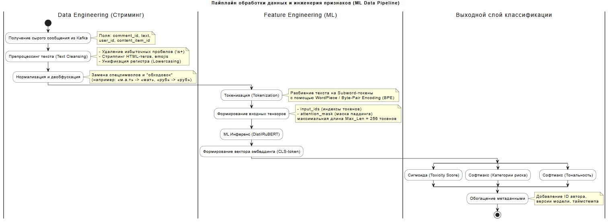

# Методология Машинного Обучения и Данные

## Технологическая методология
С технической точки зрения задача мониторинга реакций и модерации контента декомпозируется на три параллельные подзадачи машинного обучения (Multi-task NLP Framework):

1. **Бинарная классификация токсичности (Toxicity Detection):** Оценка вероятности P(toxic | text) ∈ [0,1]. Относится к категории задач анализа контента на предмет нарушений (Safety/Moderation NLP).
2. **Мультиклассовая классификация категорий риска (Risk Categorization):** Определение конкретного типа нарушения. Набор классов (C) жестко синхронизирован с юридическими требованиями (РКН) и внутренними правилами площадки:
    * c_1: Нецензурная брань / мат;
    * c_2: Разжигание ненависти / дискриминация (Hate Speech);
    * c_3: Призывы к противоправным действиям / экстремизм;
    * c_4: Спам / мошенничество / реклама;
    * c_5: Безопасный контент (Clean).

3. **Анализ тональности (Sentiment Analysis):** 
Классификация на 3 класса: *Позитивный*, *Нейтральный*, *Негативный*. Позволяет оценивать общую динамику реакций для продуктовой аналитики.

### Выбор базовой архитектуры модели
Для обеспечения баланса качества и задержки инференса (заданный системным архитектором лимит: **Latency до 500 мс**) выбран гибридный подход:

```text
[Входящий текст комментария]
                               │
               ┌───────────────┴───────────────┐
               ▼                               ▼
       [Быстрый фильтр]                [Тяжелый инференс]
   (Регулярные выражения,           (Дистиллированный BERT
  Aho-Corasick для стоп-слов)       на ONNX Runtime / TensorRT)
               │                               │
    Мат / Прямой спам найден?                  │
         ├──► ДА ──► [Автобан]                 │
         └──► НЕТ ─────────────────────────────┘
```

В качестве основной модели инференса принимается DistilRuBERT (или Russian-focused DeBERTa-v3-small), квантизованная до формата INT8/FP16 и экспортированная в среду выполнения ONNX Runtime или NVIDIA TensorRT. Это позволит уложиться в 30–50 мс на один инференс, выполняя требования по масштабируемости.

## Пайплайн обработки данных и инженерия признаков (Data Pipeline & Feature Engineering)

Для стабильной работы инференса и обучения Дата-инженер разворачивает ETL/Стриминг-пайплайн. Ниже представлена схема 
трансформации данных от момента извлечения из Kafka до подачи тензоров в ядро модели.



### Описание шагов пайплайна и фичей:
Текстовые признаки (Text Features): Исходный текст подвергается жесткой нормализации. Модель уязвима к атакам со стороны пользователей (замена кириллических букв латинскими схожими по написанию — "a", "o", "c"). Сервис предобработки на лету выполняет транслитерацию и нормализацию символов.

Контекстные/Графовые фичи (будущий техдолг): На этапе MVP мы смотрим только на текст. В будущем будут добавлены признаки автора (user_id): возраст аккаунта, количество предыдущих банов, частота отправки сообщений (детектор спам-ботов).

---

## Метрики качества: связь машинного обучения и бизнес-результата

Поскольку Product Owner несет юридическую ответственность перед регуляторами (РКН) за пропуск опасного контента, 
выбор ML-метрик строится вокруг минимизации ложноотрицательных срабатываний (FN — пропущенный токсичный комментарий).

### Матрица ошибок (Confusion Matrix) в контексте бизнес-рисков:
* True Positive (TP): Модель нашла токсичный комментарий -> Бизнес-эффект: Контент заблокирован или ушел модератору, 
штрафа нет.
* False Negative (FN): Модель посчитала комментарий безопасным, но он токсичный -> Критический бизнес-риск: Попадание 
под санкции РКН, репутационные потери.
* False Positive (FP): Модель заблокировала безопасный комментарий -> Продуктовый риск: Падение метрик вовлеченности 
(Engagement Rate), ложные баны лояльных пользователей.

### Формулировка ML-метрик

#### 1. Recall (Полнота) по токсичному классу

**Основная оптимизационная метрика**

Recall = TP / (TP + FN)

**Бизнес-требование:** На этапе MVP мы целимся в $\text{Recall} \geq 96\%$. Нам критически важно не допускать $FN$ (False Negative — пропуск токсичного сообщения).

#### 2. Precision (Точность) по токсичному классу

**Контролируемая метрика (Guardrail Metric)**

Precision = TP / (TP + FP)

**Бизнес-требование:** Падение Precision ниже $80\%$ недопустимо, иначе мы перегрузим команду ручной модерации ложными кейсами (рост операционных затрат OpEx).

#### 3. ROC-AUC и PR-AUC

Используются Data Scientist'ом при обучении для оценки разделяющей способности модели независимо от выбора порога вероятности (классификационного трешхолда).

---

## Риски этапа анализа и моделирования (ML-специфичные риски)

В дополнение к системным рискам, описанным архитектором, я выделяю специфичные риски для Data Science слоя:

| Риск | Описание риска | Стратегия смягчения                                                                                                                                                                                    |
|:-----|:---------------|:-------------------------------------------------------------------------------------------------------------------------------------------------------------------------------------------------------|
| **Data Drift** (Сдвиг данных) | Появление нового сленга, аббревиатур, мемов, политических контекстов, которые отсутствовали в обучающей выборке. Модель теряет Recall. | Настройка логирования ручной разметки в `labeling_logs`. Каждую неделю случайный сэмпл (1%) безопасных по мнению модели комментариев отправляется на валидацию модераторам для отслеживания пропусков. |
| **Target Leakage** (Утечка таргета) | При обучении модель может зацепиться за метаданные (например, ID определенных топиков/новостей, где исторически много негатива) вместо анализа самого текста. | Исключение любых метаданных (ID постов, юзеров) из признаков на этапе MVP. Обучение строго на текстовом поле.                                                                                          |
| **Обфускация контента** (Adversarial Attacks) | Намеренное искажение слов пользователями для обхода фильтров (замена букв цифрами, пробелами, символами вроде «ск.от»). | Расширение Preprocessing Service модулем деобфускации. Использование субсимвольных токенизаторов (BPE), устойчивых к опечаткам, а также аугментация обучающей выборки шумом и опечатками.              |
| **Дисбаланс классов** (Class Imbalance) | В реальном потоке из 500k комментариев токсичными могут быть всего 2-5%. Модель может оптимизироваться в сторону предсказания "всегда безопасный класс". | Применение техник взвешивания классов (Class Weights) в функции потерь (Cross-Entropy), стратегий Downsampling безопасного класса при формировании золотого датасета.                                  |

## Подготовка пилота и стратегия валидации

Валидация системы перед раскаткой на весь продакшн-поток (500 000 сообщений) пройдет в три этапа:

**Этапы пилотирования:**
1. Offline-валидация: Оценка на ретроспективных данных (исторические логи разметки за прошлый месяц). Модель считается 
готовой к пилоту, если на отложенной выборке (Hold-out dataset) выполняются условия: Recall > 96%, Precision > 80%.
2. Shadow-тестирование (Теневой режим):
   * Срок: 2 недели.
   * Модель подключается к продакшн-потоку (событиям Kafka), делает предсказания «вхолостую» и пишет результаты в prediction_logs ClickHouse.
   * Бизнес-логика соцсети никак не реагирует на вердикты модели, пользователи не блокируются.
   * Аналитическая служба сверяет решения ручной модерации с предсказаниями модели, вычисляется реальный продакшн-метрика качества на "живом" потоке.
   3. A/B-тестирование (Раскатка):
   * Контент разделяется по user_id на две группы. Контроль (50%) модерируется по старой схеме. Тест (50%) идет через разработанный пайплайн асинхронной автоматической модерации.

## Разделение на MVP и Технический долг (ML-бэклог)

Для успешного запуска системы в кратчайшие сроки совместно с Project Owner определены жесткие границы первой итерации продукта.

Входит в MVP:
* Локальная дистиллированная модель классификации текста (DistilRuBERT).
* Пайплайн обработки текста на CPU/GPU инференсе для одного языка (Русский).
* Реализация базовых регулярок для детекции нецензурной лексики.
* Оценка только текстового поля комментария без учета истории пользователя.
* Сбор логов инференса в ClickHouse для отслеживания метрик качества.

Оставляем в техническом долгу (Бэклог следующих итераций):
* Multilingual Support: Поддержка комментариев на других языках СНГ с автоматическим детектором языка.
* User Reputation Score: Учет репутации пользователя (вероятность бана растет, если у пользователя плохой бэкграунд).
* Continuous Learning (Непрерывное дообучение): Автоматический пайплайн (например, на Apache Airflow), который раз в месяц забирает новые данные из labeling_logs, дообучает модель на GPU-кластере, проверяет метрики и пушит новую версию в Model Registry.
* Malignant Image/Link Detection: Анализ прикрепленных к комментариям картинок, мемов и внешних ссылок (сейчас проверяется только текст).


## Приложение

Код диаграммы пайплайна данных (PlantUML)
```txt
@startuml
title Пайплайн обработки данных и инженерия признаков (ML Data Pipeline)

skinparam shadowing false
skinparam linetype ortho
skinparam databaseBackgroundColor white
skinparam activityBackgroundColor white

|Data Engineering (Стриминг)|
start
:Получение сырого сообщения из Kafka;
note right
  Поля: comment_id, text,
  user_id, content_item_id
end note

:Препроцессинг текста (Text Cleansing);
note right
  - Удаление избыточных пробелов (\s+)
  - Стриппинг HTML-тегов, emojis
  - Унификация регистра (Lowercasing)
end note

:Нормализация и деобфускация;
note right
  Замена спецсимволов и "обходовок"
  (например: «м.а.т» -> «мат», «pуб» -> «руб»)
end note

|Feature Engineering (ML)|
:Токенизация (Tokenization);
note right
  Разбиение текста на Subword-токены
  с помощью WordPiece / Byte-Pair Encoding (BPE)
end note

:Формирование входных тензоров;
note right
  - input_ids (индексы токенов)
  - attention_mask (маска паддинга)
  максимальная длина Max_Len = 256 токенов
end note

:ML Инференс (DistilRuBERT);
:Формирование вектора эмбеддинга (CLS-token);

|Выходной слой классификации|
split
    :Сигмоида (Toxicity Score);
split again
    :Софтмакс (Категории риска);
split again
    :Софтмакс (Тональность);
end split

:Обогащение метаданными;
note right
  Добавление ID автора,
  версии модели, таймстемпа
end note

stop
@enduml
```
